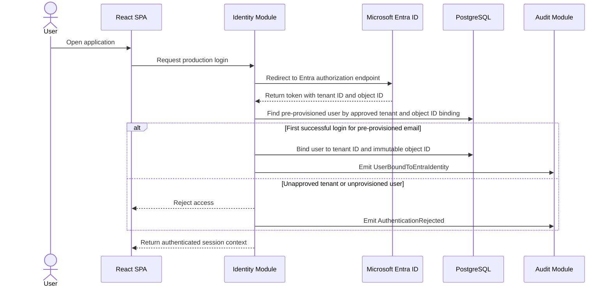
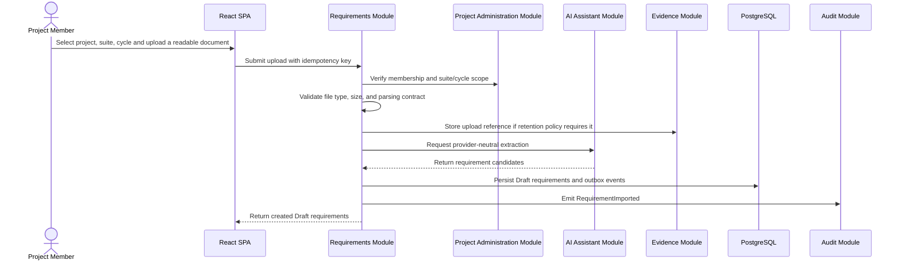
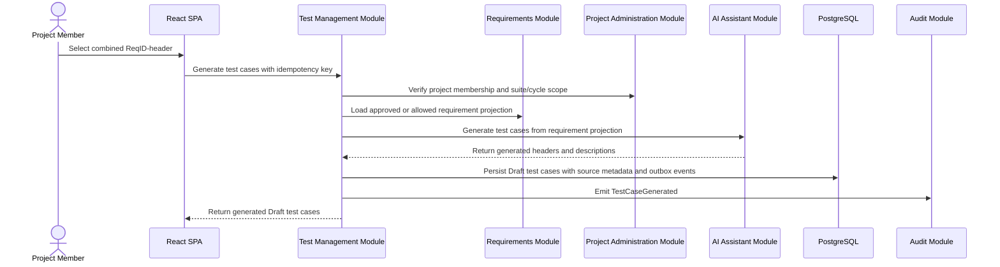
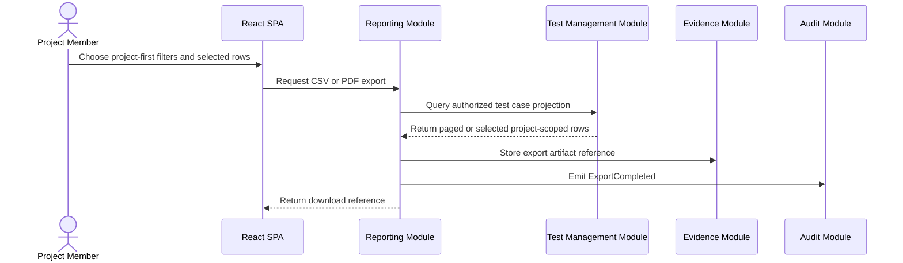
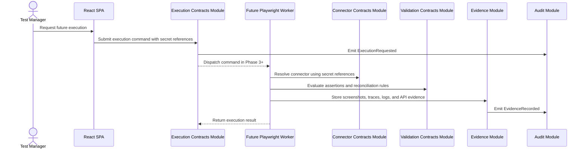

# Data Flow

This document describes core data flows and event boundaries for `AUTH-01` through `AUTH-03`, `REQ-01` through `REQ-04`, `TC-01` through `TC-06`, `VIEW-01`, `VIEW-02`, `P2-01`, `P2-02`, `EXEC-01`, `EXEC-02`, `REPORT-01`, `NFR-01`, and `NFR-02`.

## SSO Login And Binding

Authorization never uses mutable email or preferred username as the key after binding.

## Upload Requirement Flow

The upload flow must reject unsafe or unauthorized files before AI processing.

## AI Test Generation Flow

AI output cannot directly write requirement or test case tables. The owning module validates and persists accepted results.

## Export Flow

Exports respect server-side authorization, filters, sorting, pagination, and selected rows.

## Future Execution Flow

Phase 1/2 provides contracts and evidence boundaries only. It must not depend on browser automation to create requirements, create test cases, generate predefined cases, or export data.

## Data Classification

| Data | Classification | Handling |
| --- | --- | --- |
| Entra tenant ID and object ID | Sensitive identity metadata | Store for authorization binding; audit access and changes. |
| First name, last name, email | Personal data | Store for provisioning and display; do not use mutable email as authorization key after binding. |
| Project, suite, cycle, requirement, test case data | Customer project data | Tenant/project scoped; included in audit and export controls. |
| Uploaded requirement documents | Customer confidential content | Validate, scan, parse safely, store only through approved evidence/storage policy. |
| AI prompts and responses | Derived customer content | Provider-neutral handling, project scoped, no secrets, audit metadata. |
| Export artifacts | Customer confidential content | Store with project-scoped access and audit downloads. |
| Evidence screenshots/traces/API payloads | Highly sensitive test evidence | Store behind Evidence provider, strict access control, retention policy, and audit. |
| Secrets and credentials | Secret | Store references only; raw values live in environment variables or approved secret providers. |
