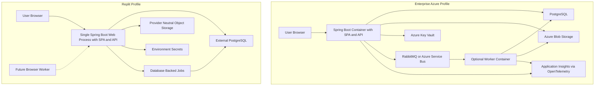

# Deployment Profiles

The application supports two profiles under `DEPLOY-01`, `ADR-002-replit-single-port`, and `ADR-003-provider-adapters`.

## Enterprise / Azure Profile

Enterprise deployment uses Docker containers and Azure-managed services.

| Concern | Enterprise / Azure |
| --- | --- |
| Runtime | Docker container for Spring Boot API and static SPA, plus separately deployable workers when needed |
| Database | PostgreSQL |
| Object storage | Azure Blob Storage through Evidence/Object Storage provider |
| Secrets | Azure Key Vault through Secret Provider |
| Messaging | RabbitMQ or Azure Service Bus through Broker Provider |
| Observability | OpenTelemetry with Application Insights exporter |
| Async jobs | Broker-backed workers, with transactional outbox for reliable publication |
| Future browser automation | Separately deployed Playwright worker with secret references and evidence upload |

## Replit Profile

Replit deployment must start with one externally exposed web process.

| Concern | Replit |
| --- | --- |
| Runtime | One Spring Boot process serving the built React SPA and REST API on `0.0.0.0:${PORT}` |
| Database | External PostgreSQL |
| Object storage | External object storage through provider interface, or local/dev provider only for non-production development |
| Secrets | Environment variables only |
| Messaging | In-process/database-backed jobs for Phase 1/2 |
| Observability | OpenTelemetry-compatible logs/traces without requiring Application Insights to start |
| Async jobs | Database job table plus idempotent handlers |
| Future browser automation | Separately deployable browser worker; not required for Phase 1/2 startup |

Replit must not require Docker Compose, RabbitMQ, Azure Key Vault, Azure Blob Storage, or Application Insights merely to start.

## Deployment Diagram

## Failure Domains

| Failure | Enterprise Handling | Replit Handling |
| --- | --- | --- |
| Web runtime failure | Container restart; workers may continue broker work. | Single process restart; database job state preserves retryable work. |
| Database unavailable | API rejects writes and returns controlled errors; workers pause. | Same behavior; startup should fail fast with clear configuration error. |
| Broker unavailable | Outbox retains unpublished events; workers resume after broker returns. | No broker dependency in Phase 1/2; database jobs continue when database is available. |
| Object storage unavailable | Evidence/export uploads fail safely and remain retryable. | Provider failure is surfaced; no Azure Blob dependency to start. |
| AI provider unavailable | Generation job fails with retryable/failed state; no partial requirement/test records without source metadata. | Same behavior using provider-neutral adapter. |
| Future browser worker unavailable | Execution requests remain pending or disabled; Phase 1/2 features unaffected. | Same; worker is separately deployable and optional for Phase 1/2. |

## Idempotency

Generation, import, export, evidence recording, and future execution commands require idempotency keys. Retried commands must return the existing result or continue the existing job without duplicating requirements, test cases, evidence records, or exports.
