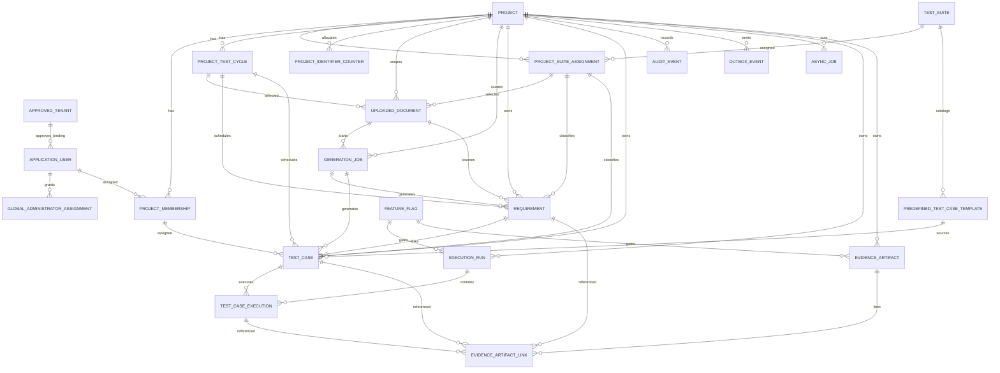

# ER Diagram

This diagram shows the initial persistence baseline. Future execution/evidence contract tables are present as metadata only and remain disabled behind feature flags until a later approved implementation.

