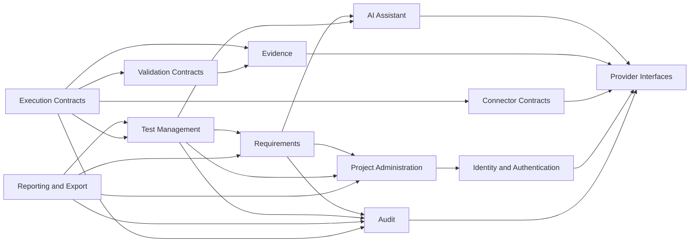

# Module Map

This document maps bounded modules to baseline services, implementation phase, dependencies, domain events, and ownership rules. It supports `ARCH-01`, `NFR-01`, and `NFR-02`.

## Boundary Rules

- Direct cross-module repository access is prohibited.
- A module may access only its own persistence repositories.
- Cross-module reads use public query services or API DTO projections owned by the called module.
- Cross-module state changes use public command services or domain events.
- Internal domain entities must not be exposed as API DTOs or stored by another module.
- Domain events must include event ID, event type, aggregate ID, tenant ID when available, project ID when available, actor ID, occurred-at UTC timestamp, correlation ID, causation ID, schema version, and idempotency key when applicable.
- Editable records use optimistic locking.
- All timestamps are UTC.

## Modules

| Module | Baseline Service | Phase | Owns | May Depend On | Prohibited Dependencies |
| --- | --- | --- | --- | --- | --- |
| Identity and Authentication | Authentication Service | Phase 1 | Pre-provisioned users, approved tenants, Entra binding, role claims, auth audit inputs | Audit, Secret Provider, Telemetry | Project/test repositories, mutable email authorization keys |
| Project Administration | Project Management Service | Phase 1 | Projects, environments, project users, roles, suites, cycles | Identity public user lookup, Audit | Requirement/test repositories |
| Requirements | Requirement Service | Phase 1 | Requirements, requirement imports, approval state, requirement deletion policy | Project public membership/suite/cycle queries, AI Assistant interface, Audit, Evidence contract | Project repositories, test case repositories except linked-count policy through Test Management public query |
| Test Management | Test Management Service | Phase 1 and Phase 2 | Test cases, ad hoc cases, requirement-linked cases, predefined source tracking, assignment, status, deletion policy | Project public membership/suite/cycle queries, Requirements public lookup, AI Assistant interface, Audit | Requirement repositories, Project repositories |
| AI Assistant | AI Assistant Service | Phase 1 and Phase 2 | Provider-neutral prompts, generation jobs, model provider interface, safe AI input/output metadata | Audit, Evidence contract, Secret Provider, Job interface | Direct persistence writes to requirements or test cases |
| Reporting and Export | Reporting Service | Phase 1 | CSV/PDF/Excel export commands, report projections, export audit | Test Management public query, Requirements public query, Project authorization, Audit, Evidence contract | Source module repositories |
| Audit | Audit Service | Phase 1 | Audit event ledger, correlation metadata, actor/action/resource records | Outbox, Telemetry | Business state mutation in other modules |
| Evidence | Evidence Service | Contract-only in Phase 1/2 | Evidence metadata, object references, access policy, provider interface | Project authorization, Audit, Storage Provider | Raw credentials or test case secret storage |
| Execution Contracts | Execution Service | Contract-only in Phase 1/2 | Execution command contracts, job state contract, future worker contract | Test Management public query, Evidence contract, Connector contracts, Validation contracts, Audit | Browser automation dependency in Phase 1/2 business flows |
| Connector Contracts | Connector Service | Contract-only in Phase 1/2 | UKG, Boomi, SFTP, DB connector interfaces, secret-reference model | Secret Provider, Audit, Telemetry | Raw secret persistence |
| Validation Contracts | Validation Service | Contract-only in Phase 1/2 | Assertion and reconciliation contracts | Evidence contract, Connector contracts, Audit | Direct execution of Phase 3 rules in Phase 1/2 |

## Allowed Dependency Direction

## Domain Events

| Event | Publisher | Consumers | Requirements |
| --- | --- | --- | --- |
| `UserProvisioned` | Identity and Authentication | Audit, Project Administration | AUTH-01, NFR-01 |
| `UserBoundToEntraIdentity` | Identity and Authentication | Audit | AUTH-02 |
| `ProjectCreated` | Project Administration | Audit, Reporting projections | RBAC-02, PROJ-01 |
| `ProjectUserRoleAssigned` | Project Administration | Audit, Reporting projections | RBAC-03 |
| `SuiteCreated` | Project Administration | Audit | RBAC-03, RBAC-04 |
| `CycleCreated` | Project Administration | Audit | RBAC-03, RBAC-04 |
| `RequirementImported` | Requirements | Audit, Reporting projections | REQ-01, REQ-02 |
| `RequirementCreated` | Requirements | Audit, Reporting projections | REQ-01, REQ-02 |
| `RequirementApproved` | Requirements | Audit, Reporting projections | REQ-03 |
| `RequirementDeleted` | Requirements | Audit, Reporting projections | REQ-04 |
| `TestCaseCreated` | Test Management | Audit, Reporting projections | TC-01 through TC-06 |
| `TestCaseImported` | Test Management | Audit, Reporting projections | TC-02, TC-06 |
| `TestCaseGenerated` | Test Management | Audit, Reporting projections | TC-01, P2-01 |
| `TestCaseDeleted` | Test Management | Audit, Reporting projections | TC-05, P2-02 |
| `ExportRequested` | Reporting and Export | Audit, Evidence | VIEW-02, REPORT-01 |
| `ExportCompleted` | Reporting and Export | Audit, Evidence | VIEW-02, REPORT-01 |
| `EvidenceRecorded` | Evidence | Audit, Reporting projections | EXEC-02 |
| `ExecutionRequested` | Execution Contracts | Audit, Evidence | EXEC-01, EXEC-02 |

## Transaction And Outbox Strategy

Every command that mutates owned data persists its aggregate change and outbox event in one PostgreSQL transaction. In Replit, an in-process/database-backed dispatcher publishes or handles events. In Enterprise/Azure, the same outbox can publish to RabbitMQ or Azure Service Bus through a broker adapter. Event handlers must be idempotent and track processed event IDs.

