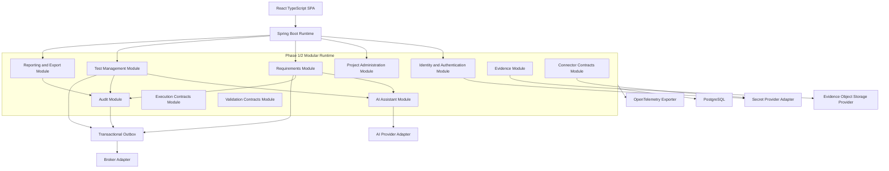

# Solution Overview

This document defines the Phase 1/2 architecture for the UKG Test Management Tool application. It preserves the target service-oriented architecture while approving one Spring Boot runtime for Phase 1/2 delivery. It cross-references `ARCH-01`, `DEPLOY-01`, `AUTH-01` through `AUTH-03`, `RBAC-01` through `RBAC-04`, `REQ-01` through `REQ-04`, `TC-01` through `TC-06`, `VIEW-01`, `VIEW-02`, `P2-01`, `P2-02`, `EXEC-01`, `EXEC-02`, `INT-01`, `REPORT-01`, `NFR-01`, and `NFR-02`.

## Executive Decision

Phase 1 and Phase 2 use a modular monolith: one Spring Boot runtime containing strict bounded modules that map one-to-one to the documented services. Module APIs, domain events, provider interfaces, database ownership, and OpenAPI contracts must be designed so modules can later be extracted into separately deployed services without rewriting business rules.

This does not erase the target microservice architecture. It defers physical distribution until the product has stable contracts, clearer load profiles, and proven operational needs.

## Deployment Style Comparison

| Criteria | Fully Distributed Microservices Now | Phase 1/2 Modular Monolith |
| --- | --- | --- |
| Runtime shape | Separate deployable services per domain plus message broker and service-to-service auth. | One Spring Boot runtime with strict modules and internal interfaces/events. |
| Delivery speed | Slower initial delivery due to CI/CD, network contracts, distributed tracing, broker setup, local dev complexity, and per-service infrastructure. | Faster baseline delivery while still preserving module ownership and extraction seams. |
| Security | Strong service isolation but more inter-service tokens, secrets, and network policy to secure. | Fewer runtime trust boundaries; still requires server-side RBAC, tenant/project isolation, and package boundary enforcement. |
| Failure domains | Better isolation if one service fails, but cascading failures must be designed and tested early. | One runtime is a larger failure domain; async jobs, idempotency, outbox, and profile-specific adapters reduce blast radius for Phase 1/2. |
| Data consistency | Requires distributed transactions, sagas, outbox, and eventual consistency from day one. | Local transactions are available inside owning modules; outbox prepares future event publication. |
| Replit portability | Harder because multiple services, broker, Key Vault, and Azure Blob cannot be required merely to start. | Fits `DEPLOY-01`: one exposed process serving SPA and API with external PostgreSQL and environment secrets. |
| Enterprise readiness | Strong service scaling from the start. | Enterprise adapters and worker extraction remain available without forcing Phase 1/2 complexity. |
| Recommended use | Later extraction after module boundaries, load, and team ownership justify it. | Approved default for Phase 1/2 under `ADR-001-phase1-modular-runtime`. |

## Architecture Principles

- Each bounded module owns its domain model, repositories, migrations, service policies, and domain events.
- API DTOs stay separate from persistence entities.
- Direct cross-module repository access is prohibited.
- Cross-module behavior uses public module services, domain events, or provider interfaces.
- Every project-scoped operation validates tenant, user, role, and project membership server-side.
- Every mutation that matters to compliance emits an audit event.
- Asynchronous work uses idempotency keys and outbox-backed event publication where retries are possible.
- Provider adapters hide AI, storage, messaging, secrets, monitoring, connector, and evidence implementation details.

## Architecture Requirement Coverage

| Area | Requirement IDs |
| --- | --- |
| Authentication and RBAC | AUTH-01, AUTH-02, AUTH-03, RBAC-01, RBAC-02, RBAC-03, RBAC-04 |
| Project administration | PROJ-01 |
| Requirements | REQ-01, REQ-02, REQ-03, REQ-04 |
| Test management | TC-01, TC-02, TC-03, TC-04, TC-05, TC-06 |
| View and export | VIEW-01, VIEW-02, REPORT-01 |
| Phase 2 predefined cases | P2-01, P2-02 |
| Future execution and integrations | EXEC-01, EXEC-02, INT-01 |
| Deployment and quality | DEPLOY-01, ARCH-01, NFR-01, NFR-02 |

## Phase Scope

| Module | Phase 1 | Phase 2 | Future / Deferred |
| --- | --- | --- | --- |
| Identity and Authentication | Implement | Extend as needed | None |
| Project Administration | Implement | Extend as needed | None |
| Requirements | Implement | Extend as needed | None |
| Test Management | Implement | Implement predefined source tracking | Execution status expansion after Phase 2 |
| AI Assistant | Implement requirement and test generation contracts | Implement predefined generation contracts | Failure analysis later |
| Reporting and Export | Implement CSV/PDF test case export | Extend as needed | Power BI deep integration later if needed |
| Audit | Implement | Extend as needed | Retention and SIEM integration later |
| Evidence | Contract and storage interface | Contract and source references | Full evidence capture in Phase 3+ |
| Execution Contracts | Contract-only | Contract-only | Playwright workers and execution screens in Phase 3+ |
| Connector Contracts | Contract-only | Contract-only | UKG/Boomi/SFTP/DB adapters expanded in Phase 3+ |
| Validation Contracts | Contract-only | Contract-only | Rule execution and reconciliation in Phase 3+ |

## Component Diagram

## Target Microservice Preservation

The physical target remains deployable services aligned to the modules above. Extraction candidates must already have:

- Published OpenAPI or event contracts.
- No direct repository calls from other modules.
- Clear table ownership and migration namespace.
- Idempotent commands and replay-safe event handlers.
- Provider interfaces for external dependencies.
- Independent audit and telemetry boundaries.

Phase 1/2 can run in one process, but architecture reviews must reject code that assumes modules can never become separate services.

## Persistence Baseline

The initial PostgreSQL schema is documented in `docs/architecture/data-dictionary.md` and `docs/architecture/er-diagram.md`. Each bounded module owns its persistence entities and repositories. Cross-module production access must use module APIs, projections, or events rather than importing another module's repository.
