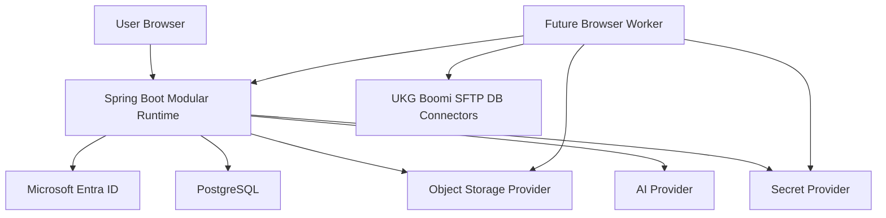

# Threat Model

This threat model covers Phase 1/2 architecture and contract-only future execution. It supports `AUTH-01` through `AUTH-03`, `RBAC-01` through `RBAC-04`, `REQ-01` through `REQ-04`, `TC-01` through `TC-06`, `VIEW-01`, `VIEW-02`, `EXEC-01`, `EXEC-02`, `INT-01`, `REPORT-01`, `NFR-01`, and `NFR-02`.

## Trust Boundaries

Every arrow crosses a trust boundary and requires authentication, authorization, validation, telemetry, and safe error handling appropriate to the data classification.

## Threats And Controls

| Threat | Example | Controls |
| --- | --- | --- |
| Unapproved tenant access | User authenticates from a tenant not approved for the application. | Validate Entra tenant ID; reject and audit unapproved tenants. |
| Mutable identifier abuse | User email changes and accidentally maps to another provisioned record. | Bind authorization to immutable object ID and tenant ID, never email/preferred username. |
| Cross-project data leakage | User queries test cases from another project by changing URL or filter values. | Server-side project membership checks on every query/mutation/export; project ID in domain events and audit. |
| Privilege escalation | Test Lead calls suite creation API directly. | Backend RBAC policy rejects forbidden role actions regardless of UI. |
| Unsafe upload | A malicious or malformed uploaded file triggers parser abuse or data exfiltration. | Size limits, secure parsing, scanning hooks, quarantine/fail-closed behavior, and no AI processing before readable content is validated. |
| AI data leakage | Prompt includes secrets or data from another project. | Prompt assembly inside owning module, project-scoped data retrieval, redaction, provider-neutral adapter, audit metadata. |
| Export oversharing | CSV/PDF export includes rows outside selected project. | Reporting uses Test Management authorized projection, not direct table access; audit export filters and actor. |
| Evidence exposure | Screenshot or trace contains sensitive UKG data. | Evidence provider stores access-controlled object references; downloads require project authorization and audit. |
| Secret exposure | Connector credentials stored in test cases or logs. | Secret references only; raw values remain in environment variables or secret provider; log scrubbing. |
| Event replay duplication | Retried generation creates duplicate test cases. | Idempotency keys, optimistic locking, outbox event ID tracking, replay-safe handlers. |
| Runtime profile drift | Replit startup silently starts requiring Azure-only services. | Profile contract tests; provider adapters with portable implementations; no hard Azure dependency at boot. |

## Audit Boundary

Audit records are compliance data. They must be append-only from business modules, include correlation ID and actor identity, and reference resources by stable IDs. Audit must not mutate business state in other modules.

## Evidence Boundary

Evidence records are not test cases. Test cases may reference evidence through stable IDs once execution exists, but credentials, screenshots, traces, logs, and API payloads remain in Evidence-owned storage and metadata. Evidence is project-scoped, access-controlled, audited, and behind a provider interface.

## Isolation Requirements

- Tenant isolation begins at authentication and continues through all project-scoped queries.
- Project ID must be part of authorization checks, audit events, exports, evidence metadata, and AI generation context.
- Database queries must include project constraints for project-owned data.
- Asynchronous event handlers must re-check authorization context or operate only on immutable command context captured at authorization time.

## Residual Risks

| Risk | Baseline Handling | Follow-up |
| --- | --- | --- |
| Legacy `.doc` parsing support varies by profile. | Keep `.doc` as required input and document profile-specific parser capability. | Resolve `CONF-005`. |
| Deletion roles may be too permissive. | Apply approved default from source and use audited soft delete. | Resolve `CONF-001` and `CONF-002`. |
| Future execution UI is undefined. | Keep contracts and evidence model only in Phase 1/2. | Resolve `CONF-006` before Phase 3. |
